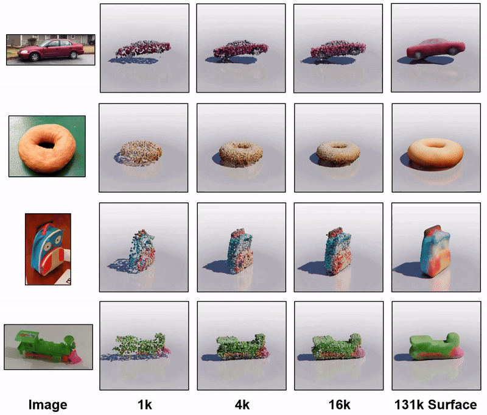

# PointInfinity

[[Project Page]](https://zixuanh.com/projects/pointinfinity)  [[Paper]](https://zixuanh.com/projects/pointinfinity/paper.pdf)



This repository currently includes the core code of the default denoiser in PointInfinity.

## License
The majority of PointInfinity is licensed under CC-BY-NC, however portions of the project are available under separate license terms: Point-E are licensed under the MIT license.

## Acknowlegement and Reference
Part of this implementation is based on [MCC](https://github.com/facebookresearch/MCC), [Point-E](https://github.com/openai/point-e) and [RIN](https://arxiv.org/pdf/2212.11972). If you find our work helpful, please consider citing these works, as well as ours:
```
@inproceedings{huang2024pointinfinity,
  title={PointInfinity: Resolution-Invariant Point Diffusion Models},
  author={Huang, Zixuan and Johnson, Justin and Debnath, Shoubhik and Rehg, James M and Wu, Chao-Yuan},
  booktitle={Proceedings of the IEEE/CVF conference on computer vision and pattern recognition},
  year={2024}
}
```